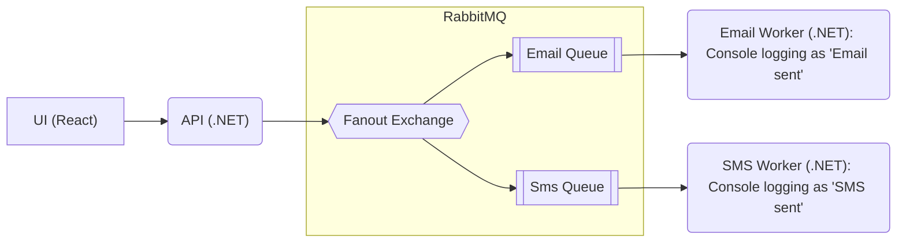

# rabbitmq-demo

> [!NOTE]
> This is a **learning/demo project** showcasing RabbitMQ messaging patterns with .NET.
> See [Possible Enhancements](#possible-enhancements) for known gaps and planned improvements.

A **learning-oriented** .NET 10 demo application using RabbitMQ for message brokering with an API, email/SMS workers, and a React UI.



## Prerequisites

- [Docker](https://docs.docker.com/get-docker/)
- [.NET 10 SDK](https://dotnet.microsoft.com/download/dotnet/10.0)
- [Node.js](https://nodejs.org/) (for the UI)

## Run Locally

### 1. Start RabbitMQ

```bash
docker compose up -d
```

RabbitMQ management UI will be available at `http://localhost:15672` (user: `user`, password: `password`).

### 2. Run the API

```bash
cd app/api/src
dotnet run
```

The API starts at `http://localhost:5139`.

### 3. Run the Workers

In separate terminals:

```bash
# Email worker
cd app/email-worker/src
dotnet run
```

```bash
# SMS worker
cd app/sms-worker/src
dotnet run
```

### 4. Run the UI

```bash
cd app/ui
pnpm install
pnpm run dev
```

The UI starts at `http://localhost:5173`. Open it in your browser, fill in the form, and submit a message.

### Verify

Look at the console logs of the API and workers to confirm messages are being published and processed.

## Running Tests Locally

### Backend (unit & integration)

```bash
# Run all backend tests
cd app
dotnet test

# Or run individually
cd app/api/tests && dotnet test
cd app/email-worker/tests && dotnet test
cd app/sms-worker/tests && dotnet test
```

Requires Docker — the integration tests use Testcontainers to spin up a real RabbitMQ instance.

### UI

```bash
cd app/ui
pnpm test
```

### End-to-End

```bash
cd e2e
pnpm test
```

Requires the app to be running locally.

## Possible Enhancements

- **Persistent delivery mode** — messages are not marked as persistent; a RabbitMQ restart loses them
- **Retry & dead-lettering** — both workers have a `TODO` for retry logic and DLQ for failed messages
- **Connection resilience** — API and workers create a single connection at startup with no reconnection if RabbitMQ goes down
- **API validation** — no input validation or error responses beyond a 200 OK
- **UI error handling** — only checks `response.ok`; no loading state, no error display
- **OpenTelemetry** — distributed tracing across API and workers for observability